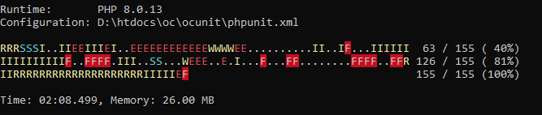

# OCUnit

Merchant oriented test scripts for [OpenCart](https://github.com/opencart/opencart/) based on [PHPUnit](https://phpunit.de).

__WARNING__: Never execute these tests against your live database or __in server environment__.
It is likely to override the  product information, pricing, images, session, passwords and more.
The database may never return to its original state.

This project is NOT about developing the [core OpenCart](https://github.com/opencart/opencart) but the implementation
of OpenCart to run a store.

Business rules may differ per business. Hence, most of the tests are empty.
But they should guide you technically on how to write teh tests.

OCUnit reads the actual database configuration values and URLs from within your OpenCart to run tests. There are
few [business rules](config.ini) and configurations you should edit before running the test.

But please take a backup first! Run OCUnit at your own risk.

# Test Examples

* A corresponding image should exist for product or category.
    * Product Image: 800 px x 400 px
    * Category Image: 200 px x 200 px
* A "downloadable" file has to be in a .zip file only.
* Directory listing should be disabled throughout the website,
* Store price cannot be less than the manufacturer price even after discounts.
* Updating price makes a history of price change.
  [*] Keep a log of when prices were changed.
  [*] Maintain a price change history.
  [*] Create a price log table.
* Products must have videos associated with them in their description.
* Concise inventory statistics generation.

Not [all the tests](logs/testdox.txt) are complete. See those with x mark.

# Test Cases

Case                       | Description
---------------------------|---------------------------------
[admin](cases/admin)       | various tests in admin features
[api](cases/api)           | API tests as on [documentation](https://docs.opencart.com/en-gb/system/users/api/)
[business](cases/business) | business logic tests
[catalog](cases/catalog)   | frontend general tests
[core](cases/core)         | opencart core tests
[database](cases/database) | tests with direct database hits
[general](cases/general)   | other uncategorized tests appear here
[issues](cases/issues)     | For issues imported from GitHub
[mail](cases/mail)         | test email sending features
[report](cases/report)     | inventory and database statistics from merchant's perspectives

# Requirements

Dependency                     | Version                       | Description
-------------------------------|-------------------------------|---------------------
[PHP](https://www.php.net/)    | 8.0.8+                        | -
[PHPUnit](https://phpunit.de/) | 9.5.10+                        | -
[OpenCart](https://github.com/opencart/opencart)               | 4.0.0+ | master branch
[relay.php](https://packagist.org/packages/anytizer/relay.php) | -      | composer package of a minimal HTTP client

# Installation

Clone OpenCart and OCUnit projects. Then install/configure them independently in "/oc/store" and "/oc/ocunit":

    cd htdocs|public_html|www|web
    mkdir oc
    cd oc

    git clone https://github.com/opencart/opencart.git store
    git clone https://github.com/anytizer/ocunit.git ocunit

Download the phpunit phar file in the directory.

    cd ocunit
    wget https://phar.phpunit.de/phpunit-9.5.10.phar

    mv phpunit-9.5.10.phar phpunit.phar

Update the composer dependencies:

    wget https://getcomposer.org/download/latest-stable/composer.phar
    php composer.phar update

# Configuration of OCUnit

* Edit [config.ini](config.ini) for project paths, business rules, catalog information etc.
* Carefully edit your statistics in `$tables_counters`.

# Test Execution

    cd admin
    php ../phpunit.phar cases/admin

Or,

    cd catalog
    php ../phpunit.phar cases/catalog

* Under Windows: `.\run8.0.bat`
* Or, under Linux: `./run8.0.sh`

More information on tests is available at: https://phpunit.readthedocs.io/en/9.5/textui.html.

## Logs Produced

* `logs/testdox.txt` - Log of test status - pass or fail
* `logs/inventory.log` - concise report about products and prices for the merchant.

# Inspirations

* https://github.com/beyondit/opencart-test-suite
* [Selenium : OpenCart User Creation Automation Test With CSS Locators](https://www.youtube.com/watch?v=DEwzzZfMYwM)
* [Unit testing, Jenkins, code sniffing, github etc](https://forum.opencart.com/viewtopic.php?t=124532)
* https://gitlab.com/abricos07/opencart/-/tree/master
* https://github.com/sarkershantonu/OpencartTesting

# Contribution

If you have a specific idea on how OCUnit (Test scripts for OpenCart based on PHPUnit) should function, fork the project
and open pull request for your new test cases. Or, create a [new issue](https://github.com/anytizer/ocunit/issues/new)
in __@anytizer__/ocunit project.

# Made with

* [VS Code](https://code.visualstudio.com/download) + [SonarLint](https://www.sonarlint.org/)
* [PHPStorm](https://www.jetbrains.com/phpstorm/?from=anytizer)
