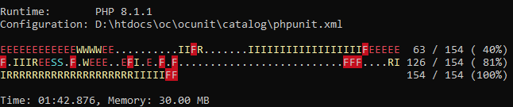
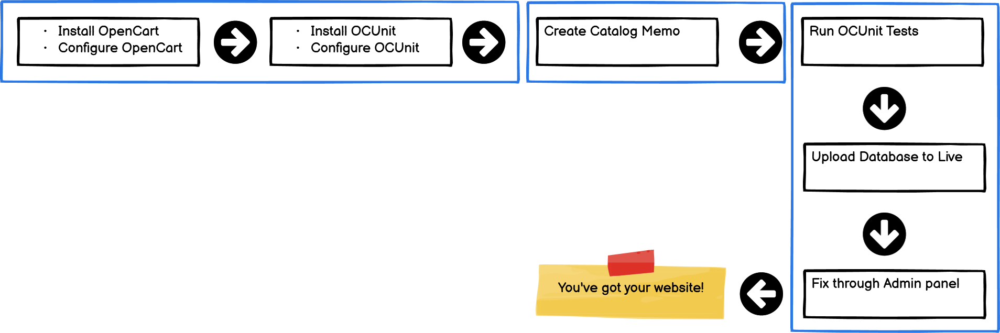

# OCUnit

Merchant oriented scripts for [OpenCart](https://github.com/opencart/opencart/) based on [PHPUnit](https://phpunit.de).

It partially overrides the default OpenCart installation, i.e. [install/opencart.sql](https://github.com/opencart/opencart/blob/master/upload/install/opencart.sql) and re-builds with your own [memo](ini/categories/).

* [Frequently asked questions](FAQ.md)
* [How to operate](#three-steps-of-operation)
* Read me - below.

---

## WARNING

Never execute these scripts against your live database or __in production server environment__.

THIS IS AN EXPERIMENTAL SOFTWARE.

It will overwrite the product information, pricing, images, currencies, customers, users, session, emails, passwords, .htaccess and more.
Almost any information will be destroyed, and recreated.
It even truncates a lot of `oc_*` tables!

The database will NEVER return to its original state.
So, OCUnit is for you only if you are setting up your store for the __first__ time.

**Run OCUnit at your own risk.**
The developers of OCUnit cannot be responsible for your accidental damage to the database on your store.

---

OCUnit is better when you are about to set up a __new store__.
If you have already set up a store that is live, and you **do not have a local copy of your catalog memo**, do not run these tests.

## Disclaimer Story

This project is NOT about developing the [core OpenCart](https://github.com/opencart/opencart/),
but the implementation of that software to run a store.
Please do not expect a code coverage test for OpenCart.

End user of OCUnit is a semi techincal store owner or a development team dedicated to support the store onwer establish digital a store.

OCUnit reads the ACTUAL database configuration values and URLs from within your OpenCart's config.php files to run tests.
There are few [business rules](ini/config.ini) and configurations you should edit, to prepare your use.
Rules may differ as per businesses. So, most of the tests are empty.
But they should self-guide you technically on how to write the tests.

Some information in this document are drafts only (documented before coding).

# Test Examples

## Do test like (merchant's perspectives - yes)

* [x] A corresponding image should exist for product or category.
    * [x] Product Image: 800 px x 400 px
    * [x] Category Image: 200 px x 200 px
    * [ ] Images should be in .png format only
* [x] A "downloadable" file has to be in a .zip format only.
* [x] Directory listing should be disabled throughout the website - admin or store.
* [x] Store price cannot be less than the manufacturer price even after discounts.
* [x] Updating price makes a history of price change.
    * [x] Keep a log of when prices were changed.
    * [x] Maintain a price change history.
    * [x] Create a price log table.
* [ ] Products must have video links associated with them in their description.
* [ ] Products must have multiple images.
* [x] Concisely generate inventory statistics - [here](logs/inventory.log).
* [x] Re-create the database information from your [merchant memos](ini/categories).
    * [x] Stores and URLs
    * [x] Categories and Products
    * [x] Images
    * [ ] Languages - be always default: "1" for en-gb.
    * [x] [Information Pages](ini/information/)

## And it DOES NOT test like (code coverage - no)

* Add product feature should accept an image upload.
* The system should allow to upload a downloadable file.
* Price edit should be working fine.

More accurate progress report on individual testdox: [admin](logs/admin-testdox.txt), [catalog](logs/catalog-testdox.txt), [business](logs/business-testdox.txt) (logs produced).

These are just some samples to illustrate how business rules are created.

Tests have been now separated to [admin](./admin/cases), [catalog](./catalog/cases) and [business](./business/cases/) to
match the nature of OpenCart.

# Requirements

Dependency                     | Version                       | Description
-------------------------------|-------------------------------|---------------------
[PHP](https://www.php.net/)    | 8.1.1+                        | -
[PHPUnit](https://phpunit.de/) | 9.5.20+                       | -
[OpenCart](https://github.com/opencart/opencart)               | 4.0.0+ | master branch
[relay.php](https://packagist.org/packages/anytizer/relay.php) | -      | composer package of a minimal HTTP client
[guid.php](https://packagist.org/packages/anytizer/guid.php)   | -      | UUID generator
[parsedown](https://github.com/erusev/parsedown)               | -      | .md to .html
[phpmailer](https://github.com/phpmailer/phpmailer) or alike   | -      | to generate emails (compare with in-built smtp client)

# Sample Test Output

# Test Cases

| Folder    | Case                               | Description
|-----------|------------------------------------|------------------------------------------------
| admin     | [admin](admin/cases/admin)         | various tests in admin features
| catalog   | [api](catalog/cases/api)           | API tests as on [documentation](https://docs.opencart.com/en-gb/system/users/api/)
|           | [business](catalog/cases/business) | business logic tests
|           | [catalog](catalog/cases/catalog)   | frontend general tests
|           | [core](catalog/cases/core)         | opencart core tests
|           | [database](catalog/cases/database) | tests with direct database hits
|           | [general](catalog/cases/general)   | other uncategorized tests appear here
|           | [issues](catalog/cases/issues)     | For issues imported from GitHub and CVE Database
|           | [mail](catalog/cases/mail)         | test email sending features
|           | [report](catalog/cases/report)     | inventory and database statistics from merchant's perspectives
| business  | [cases](business/cases)            | Customized business rules

# Three steps of Operation

Install OCUnit, Configure it, Execute it, Check your store.
And finally, delete it ;-)

Since OCUnit rebuilds the OpenCart database, it is always riskier to run second time, particularly when you created your live copy of OpenCart store data.

Picture made with [Balsamiq](https://balsamiq.com/wireframes/desktop/)

## Step 1: Installation

Clone OpenCart and OCUnit projects "locally".
Then install and configure them independently in "/oc/opencart" and "/oc/ocunit".
Also, download the [phpunit](https://phar.phpunit.de/) phar file in the ocunit directory and,
update the [composer](https://getcomposer.org/) dependencies.

Again, do not install OCUnit to connect to the live database!
* Installation: download [phpunit-11.3.1.phar](https://phar.phpunit.de/phpunit.phar) and put it in here.
* Rename it to phpunit.phar and run like below.

    cd /HOME/USER/htdocs|public_html|www|web
    mkdir oc
    cd oc

    git clone https://github.com/opencart/opencart.git opencart
    git clone https://github.com/anytizer/ocunit.git ocunit

    cd ocunit

    # Download PHPUnit
    wget -oq https://phar.phpunit.de/phpunit.phar
    mv phpunit-11.3.1.phar phpunit.phar

    # Update Composer based packages
    wget -oq https://getcomposer.org/download/latest-stable/composer.phar
    php composer.phar update

## Step 2: Configurations

**Important** - right after installation, you should consider editing:

 * [ini/config.ini](ini/config.ini)
 * [ini/stores.ini](ini/stores.ini)
 * [ini/information](ini/information)
 * [ini/categories](ini/categories)

to tell something about your store information. Merchants may depend on these/(their own) files to change the behaviour of OpenCart.
Though not fully promised, OCUnit will re-build the OpenCart database based on these configurations.

## Step 3: Test Execution

You have to scope your tests for admin, catalog or business purpose. So, run them individually.

    cd admin
    php ../phpunit.phar cases/admin/

Or,

    cd catalog
    php ../phpunit.phar cases/catalog/

Or,

    cd business
    php ../phpunit.phar cases/

### Log Files Produced

* [logs/admin-testdox.txt](logs/admin-testdox.txt)
* [logs/catalog-testdox.txt](logs/catalog-testdox.txt)
* [logs/business-testdox.txt](logs/business-testdox.txt)
* [logs/inventory.log](logs/inventory.log) - concise report about products and prices for the merchant's review.

# Inspirations

* https://github.com/beyondit/opencart-test-suite
* [Selenium : OpenCart User Creation Automation Test With CSS Locators](https://www.youtube.com/watch?v=DEwzzZfMYwM)
* [Unit testing, Jenkins, code sniffing, github etc](https://forum.opencart.com/viewtopic.php?t=124532)
* https://github.com/sarkershantonu/OpencartTesting

# Contribution

If you have a specific idea on how OCUnit (Merchant's view of test scripts for OpenCart based on PHPUnit) should
function, fork the project and open pull request for your new test cases.
Or, create a [new issue](https://github.com/anytizer/ocunit/issues/new) in __@anytizer/ocunit__ project.

# Made with IDEs and Tools

* [PHPStorm](https://www.jetbrains.com/phpstorm/?from=anytizer+ocunit)
* [VS Code](https://code.visualstudio.com/download) + [SonarLint](https://www.sonarlint.org/)
* [Notepad++](https://notepad-plus-plus.org/downloads/)
* [SQLYog](https://github.com/webyog/sqlyog-community/wiki/Downloads) Community Edition
* [Neor Profile SQL](https://www.profilesql.com/)
* [Balsamiq](https://balsamiq.com/wireframes/desktop/)
